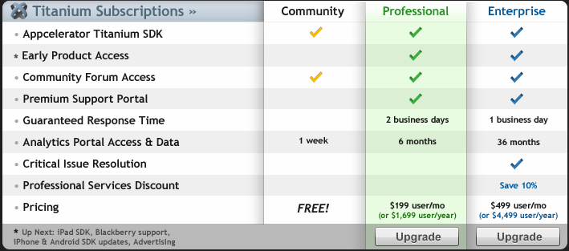

!SLIDE
# PhoneGap vs. Titanium #

# FIGHT! #

!SLIDE bullets
# They are... #

* Mobile app frameworks
* Source can include JS/CSS/HTML(5)

!SLIDE bullets
# Targeting... #

* **iPhone** and **Android** primarily
* Other platforms supported (but who cares?)

!SLIDE bullets
# Similarities #

* Both expose their own JS API for doing mobile stuff

!SLIDE small
	@@@ javascript
	//PhoneGap
	function chooseContact(allowsEditing) {
		var options = { allowsEditing: allowsEditing };
		navigator.ContactManager.chooseContact(
						chooseContact_Return, options);
	}

	function chooseContact_Return(contact) {
		if (contact) {
			navigator.notification.alert(
				contact.firstName + " " + contact.lastName, 
				"Contact Returned", "Dismiss");
		}
	}

!SLIDE smaller
	@@@ javascript
	//Titanium
	var tabGroup = Titanium.UI.createTabGroup();

	var addHtml = function(winTitle, url, tabIcon, tabTitle) {
		var win1 = Titanium.UI.createWindow({  
		    title:winTitle,
			barColor:'#000'
		});

		var webview = Ti.UI.createWebView({
			url:url
		});

		win1.add(webview);

		var tab1 = Titanium.UI.createTab({  
		    icon:tabIcon,
		    title:tabTitle,
		    window:win1
		});

		tabGroup.addTab(tab1);  
	};
	
!SLIDE bullets small

# Differences... #

* Titanium has separate products for mobile & desktop
* Titanium has an actual compile phase for the app JS
* Titanium delegates JS calls to runtime interpreter (rather than actual JS file)
* Titanium creates native widgets for UI components created via JS calls

!SLIDE center

## Titanium has multiple license models ##

!SLIDE bullets
# Demo #

* Simple PhoneGap app
* PhoneGap calling custom native code
* Titanium KitchenSink

!SLIDE bullets
# From a developers perspective #

* The feedback & dev flow is faster using PhoneGap 
* Automated testing is doable using PhoneGap

!SLIDE bullets
# Links #

* [PhoneGap](http://phonegap.com)
* [PhoneGap Native Control Plugin](http://github.com/purplecabbage/PhoneGap-Plugins)
* [Appcelerator Titanium (Mobile)](http://www.appcelerator.com/products/titanium-mobile-application-development/)
 
